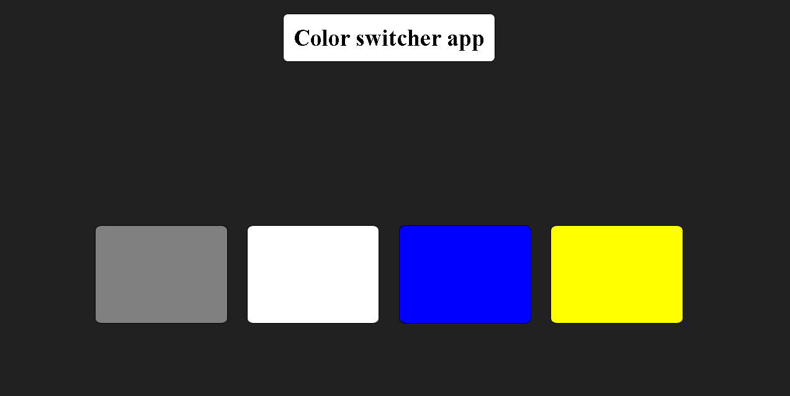

# preview :-



# script code

```javascript
const boxes = document.querySelectorAll(".box");
const body = document.querySelector("body");

boxes.forEach((boxes) => {
  console.log(boxes);
  boxes.addEventListener("click", (e) => {
    // console.log(e);
    // console.log(e.target);
    if (e.target.id === "grey") {
      body.style.backgroundColor = e.target.id;
    } else if (e.target.id === "white") {
      body.style.backgroundColor = e.target.id;
    } else if (e.target.id === "blue") {
      body.style.backgroundColor = e.target.id;
    } else if (e.target.id === "yellow") {
      body.style.backgroundColor = e.target.id;
    }
  });
});
```
